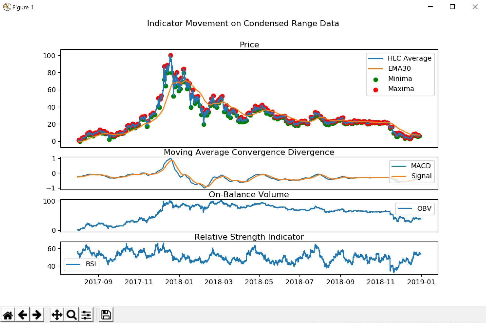
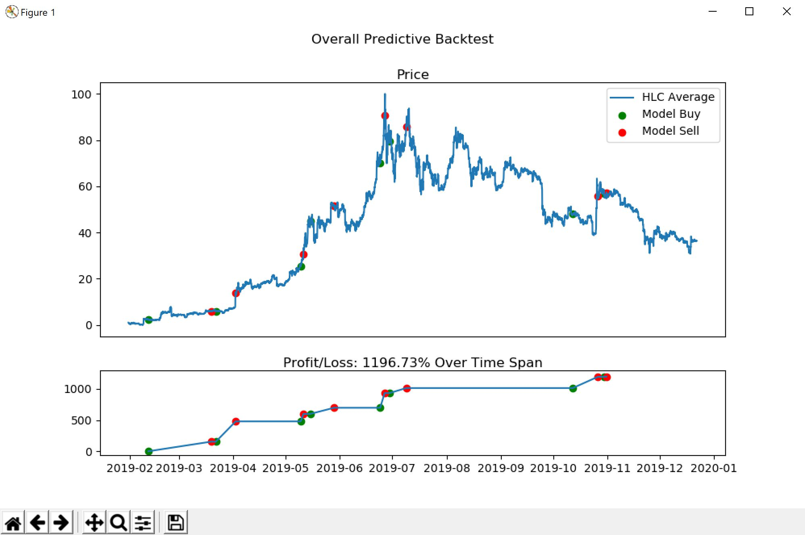

# genesis-asset-trader

Created by Weidi Zhang

## Requirements

### Versions Used For Development
Python 3.7.4

Python Packages:
- joblib 0.14.1
- graphviz 0.13.2
- matplotlib 3.1.2
- numpy 1.18.0
- pandas 0.25.3
- scikit-learn 0.22

Other Software:
- [graphviz 2.38.0](https://www.graphviz.org/download/)

Exact versions are not required but correct behavior is not guaranteed on differing versions.

## Using genesis-asset-trader

### All Files
- ```backtest_strategy.py```: Strategies implemented for backtest simulation
- ```backtest.py```: Visualization and backtest logic
- ```data_display.py```: Visualization of processed data
- ```data_processor.py```: Process datasets of an asset
- ```extrema.py```: Calculate extrema points for data processing
- ```indicators.py```: Calculate indicator data for data processing
- ```predict.py```: Predict using decision tree model and post-processing of model prediction for improvement
- ```trader.py```: Abstract class that should be used a base in creating a live trader using model predictions
- ```train.py```: Train processed data to produce decision tree model
- ```visualizer.py```: Base to streamline visualizations for all data

### Sample Flow
1. Run ```data_display.py``` to visualize the processed version of a dataset
2. Run ```train.py``` to generate and visualize the decision tree model
3. Run ```backtest.py``` to visualize result of backtesting using the trained model

### Screenshots
From ```data_display.py```:



From ```backtest.py```:



## Methodology

### Data Processing
Given a data set containing the date/time, prices (open, high, low, close), and volume of an asset over a fixed time span, we compute the following:

Indicator Data:
- HLC (high, low, close) (average used as price)
- EMA30
- EMA30 Directional Crossings
- MACD
- MACD Signal Line
- MACD Directional Crossings
- OBV
- RSI

Extrema Data (relating to price):
- Local Minima
- Local Maxima

### Fixed Ranged Data
Data is condensed and standardized into fixed ranges of either [-1, 1] for MACD indicator or [0, 100] for other data such that it can be applied to any asset or model given that their data is also condensed into this fixed range.

The shape of the data is important; the original values are not.

### Decision Tree Generation
A decision tree is trained and used in the model for predicting extremas at a given point.

It classifies the "Extrema" attribute in the data based off of the following chosen indicators:
- HLC Average
- RSI
- EMACrossDifference
- EMACrossDirection
- MACDCrossDifference
- MACDCrossDirection

For the EMA and MACD calculations, the direction of a crossing and distance of a crossing past a signal line are more standardized and have higher bearing than the value of an indicator itself - thus only these two attributes are used. Additionally, correlation to how how a price is and the strength of its movement (RSI) is also used as feature attributes in training the decision tree. Any form of OBV data has been left out in this model -- all these attributes and any settings can be modified in ```train.py```.

Note that the decision tree is generated using Gini impurity and not entropy (information gain).

### Predicting with Model
The decision tree model is used to generate predicted extremas based on a given data set (a pandas dataframe).

The predictions of these extrema is then post-processed with two heuristics to correct for accuracy:
- Remove predicted extrema with greater than a specified number of maximum conflicting opposing extremas in a fixed search region
- Remove predicted extrema with less than a specified number of agreeing extrema predictions in a fixed search region

The search region is a fixed distance backwards or before a search point, as in a real world situation only backwards data search is possible.

### Backtesting
Backtesting using predictions is done to verify how this asset trader would perform based on its predicted extremas, or buy and sell signals, in a real world situation.

The current backtesting strategy assumes that:
- Buy and sell transactions must alternate, i.e. it will not act on multiple buy signals in a row prior to selling its assets
- Profits from sell transactions are immediately reinvested for future buy transactions
- It will end the simulation or backtest with a sell transaction to gauge profits

### Automated Trading
An abstract class ```trader.py``` has been provided to help in creating live automated trading software solutions by using predictions from the model generated. 

This class implements the following features in assisting this goal:
- Base structure to follow in creating this solution
- Update data and adapt data sources into a processable dataframe
- Easily predict current extrema based on latest point in time
- Sample logic for making transactions using the model

## Notes

### Model Persistence
The provided trained model found at ```models/model.joblib``` may not work on your system - the model representation is architecture specific.

It would be best to re-generate it on your own system.

See: https://scikit-learn.org/stable/modules/model_persistence.html
